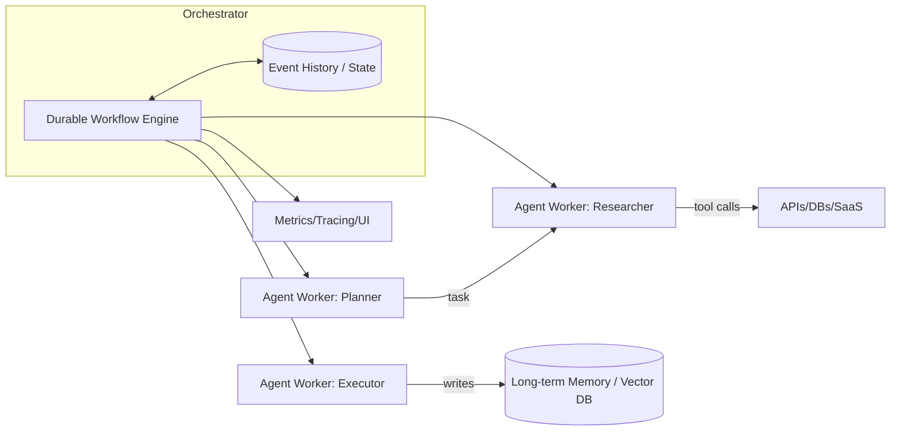

# Selection of Agent Harnesses, Frameworks, Orchestration Systems, and Memory for Agent-Based Applications

## Executive Summary

The "agent-based" application market consists of several layers often mixed in one tool: **agent logic (planning/acting/tool-calls)**, **orchestration (loops, branching, retries, durable execution)**, **memory and state (short/long-term, retrieval, persistence)**, **production operations (observability, security, deployment, cost)**. In practice, it's better to choose not "one framework" but a **construction of 3–5 components** with clear boundaries. This reduces lock-in, facilitates testing, and enables migrations.

Key architectural divide: **in-process orchestration** vs **durable orchestration**. Library agent frameworks (LangChain / LlamaIndex / Haystack) provide the fastest path to prototype and convenient integration ecosystem (e.g., LangChain emphasizes unified API across providers and large number of integrations), but reliability for long-running tasks and execution repeatability usually need to be built as a separate layer (workers, queues, WF engine, idempotency). Durable engines (Temporal) inherently provide persistent execution and recovery from event history, which is better suited for "long" business processes and controlled fault tolerance.

Regarding "memory," it's important to separate: **working memory (dialog/thread context)**, **long-term memory (vector/hybrid database, persistence)** and **operational state (state machine/workflow state)**. Vector databases (Weaviate / Milvus) and "developer-first" stores (Chroma) balance scale, search functionality (hybrid, filters), security (RBAC/TLS), observability (Prometheus/OpenTelemetry), and operational costs differently.

If you need a **quick start**: LangChain or LlamaIndex + Chroma (local/embedded) is a common low-friction starting stack, with gradual scaling to Milvus/Weaviate as load grows. If you need **production for multi-step/long processes** with strict requirements for retries/idempotency/recovery, Temporal is a strong orchestration candidate, with agent framework code running inside workers. For **compute scaling and serving** (parallelism, GPU, batching), Ray and/or BentoML are useful depending on runtime preference. For **batch ETL/cron/DAG** processes, Airflow remains strong, but its model is not about low latency or "durable agent loops."

Important update: AutoGen is marked as **maintenance mode**; Microsoft positions Agent Framework as the recommended starting point for new projects and provides migration guidance.

---

## Definitions and Boundaries

Below are practical definitions that help "unfold" the stack and avoid confusing tools with each other.

**Agent harness** — operational "wrapper" that transforms agent code into a managed system: run/stop control and limits, tracing and observability, tests/benchmarks, configuration management, secrets, log/trace retention, often — deployment and runtime for long-running tasks. Examples of harness characteristics: built-in eval/observability/bench tools (AutoGen Bench describes repeatable scenario runs in controlled conditions); platform observability and evaluation layer (LangSmith positions observability and evaluation as parts of the full lifecycle).

**Agent framework** — library/SDK for building agent logic: message abstractions, tool calling, "think → call tool → process" loops (e.g., LangChain describes agents as a system that can make sequential/parallel tool calls and maintain state between them). Some frameworks emphasize multi-agent communication (AutoGen documents multi-agent conversation framework). Important: framework is almost always **not equal** to production orchestrator.

**Workflow system** — task/process execution engine and model: DAG/graphs, schedules, retries, task distribution to workers, observability, sometimes — event-sourcing and deterministic replay. Airflow defines DAG as a model including schedule, tasks, and dependencies. Temporal describes durable execution through Workflows/Activities and Event History storage enabling failure survival. Prefect — Python pipeline orchestrator with monitoring and task/flow retries.

**Memory system** — storage and retrieval layer for state used by the agent: from "short-term memory" of dialog to long-term semantic memory and profiles. Here it's useful to separate:
- **Short-term / thread memory**: thread state and recent turns storage
- **Agent memory API**: put/get interface with customizable implementations
- **Long-term semantic memory**: vector index/DB, hybrid search, filters, multi-tenancy, RBAC
- **Retrieval pipelines**: retriever selection, rerank, citations/provenance. Conceptual basis of RAG is the combination of model's parametric memory and non-parametric memory (dense index).

---

## Evaluation Criteria and Typical Tradeoffs

Below is the "framework" for evaluation. I deliberately formulate criteria so they can be used for both open-source and SaaS/managed options.

### Architecture and Responsibility Boundaries

**Architectural question #1: where does the agent loop live and how does it survive failures.**
- **In-process loop** (inside single service/worker). Pros: minimal latency, easier debugging. Cons: if process crashes, need external recovery mechanism and idempotency of tools.
- **Durable loop** (workflow engine). Pros: persistent execution and recovery. Temporal directly describes Workflow execution "in a resilient manner" with failure handling and retries. Con: cost in complexity and in "determinism"/code model constraints.

**Architectural question #2: where is state stored.**
- "Dialog state" (chat history), "operational state" (state machine), "knowledge memory" (vector store) — these are different things and often require different stores.
- Good practice: **explicitly separate**: (a) workflow state, (b) chat-store, (c) vector DB/document store.

### Scaling, Latency, Throughput

For agent-based systems, it's useful to evaluate latency along the chain:
1. Pre-processing/routing
2. Retrieval (vector/hybrid)
3. Rerank
4. LLM inference (often dominates)
5. Tool calls (external APIs)
6. Post-processing and streaming

At the infrastructure level:
- Ray is positioned as a unified framework for scaling Python/AI applications from laptop to cluster with basic primitives (tasks, actors)
- For serving, Ray Serve describes optimizations for LLM (streaming, dynamic batching, multi-node/multi-GPU)
- BentoML focuses on model serving and explicitly mentions optimizations like dynamic batching and inference graph orchestration

### Reliability, Fault Tolerance, State Consistency

- Temporal stores Event History for the entire workflow execution lifecycle and emphasizes that history is durable and will survive service crashes. There are limits on history size (important for "chatty" agents).
- Airflow and Prefect provide retry/observability, but the model is more about tasks and scheduling than deterministic "event journal" of long-running processes.

### Security, Privacy, Compliance

Security layer is usually different by tool class:
- Agent frameworks are libraries in your application; security is mostly your responsibility (secrets, network policies, log filtering).
- Memory databases and workflow engines are separate services where TLS, auth, RBAC, audit, tenant isolation matter.

Facts by location:
- Weaviate documents RBAC and authorization model
- Milvus documents TLS (encryption in transit) and separately user authentication/RBAC
- Temporal documents security for self-hosted and Cloud; Temporal Cloud uses TLS in transit, while authentication can use API keys or mTLS certificates
- Chroma documents authentication in client-server mode and its absence in embedded mode

### Observability and Manageability

In production, evaluate not only "are there metrics" but also:
- Correlation: trace/span IDs
- Cardinality
- Ability to exclude/anonymize PII
- Presence of UI for run-level debugging
- Cost of trace storage

Examples:
- Weaviate: Prometheus-compatible metrics and Prometheus/Grafana recommendations
- Milvus: separate documentation on monitoring framework (Prometheus+Grafana)
- Chroma: observability via OpenTelemetry (tracing/logging/metrics)
- Ray: dashboard and instructions for metrics/Prometheus+Grafana
- Airflow: UI described as main interface for inspecting DAG runs and task states

### Extensibility, Integrations, API, Languages, Deployment

- LangChain emphasizes unified API across model providers and large set of integrations
- LlamaIndex separately lists integrations for LLMs and vector stores
- Haystack describes integration model (default + partner/community), and has separate core integrations repository
- Weaviate explicitly describes API (REST, GraphQL, gRPC)
- Milvus quickstart specifies REST and gRPC with client language set
- BentoML describes packaging services as "Bento" and containerize as OCI-compliant image

---

## Comparison of Popular Projects

Below is a comparative "slice" across 12 popular projects. In the table I deliberately use compact values and sometimes "author rating" (qualitative) — because absolute latency/throughput numbers depend on model, prompts, retrieval strategy, load profile, and infrastructure. Where the statement is factual (license, support mode, RBAC/TLS presence, API, architectural formulations) — I reference official sources.

### Summary Comparative Table

Legend:
- **Type**: AF=agent framework, WF=workflow system, RT=distributed runtime, SV=serving, VS=vector store/DB
- **Architecture**: Lib (embeddable library), Server (service), Engine (durable/WF engine), Hybrid (both)
- **Scale**: S=single node, H=horizontal scaling, C=cluster/multi-node
- **Reliability/FT** (qual): Low/Med/High as "how much the tool itself solves durable execution & recovery"
- **Observability**: UI/metrics/OTel per docs
- **Security**: presence of explicit TLS/auth/RBAC support in the product (not counting "behind proxy")

| Project | Type | Architecture | Languages | Deployment | API/Integrations | LLM Support | State & Memory | Persistence/Retrieval | Scale | Latency/Throughput | Reliability/FT | Observability | Security & Privacy | Maturity/Activity | License |
|---|---|---|---|---|---|---|---|---|---|---|---|---|---|---|---|
| LangChain | AF (+ecosystem) | Lib | Python, JS/TS | self-host as part of app; ecosystem includes LangSmith deployment | 1000+ integrations; unified API for providers | many providers via provider packages | memory as concept; agents with persistence across tool calls; short-term via checkpointer | retrieval via integrations (vector stores and more) (often external VS) | S/H (depends on your runtime) | low library overhead; LLM/IO dominates | Low–Med (depends on external WF/infra) | via LangSmith (tracing/evals) | mainly on you; PII-sensitive logs | active OSS; product ecosystem | MIT |
| LlamaIndex | AF/data+agents | Lib | Python (+TS) | self-host; enterprise platform LlamaParse/Parse | modular integrations; vector stores as integration points | LLM integrations list (OpenAI/Anthropic/Google/…) | memory put/get; chat stores; stateful chat engines | retrieval oriented to RAG; VS integrations | S/H (via your runtime/VS) | low library overhead; LLM/VS dominates | Low–Med | depends on your wrapper | on you (as library); enterprise options separately | active, wide integration package set | MIT |
| Haystack | AF (RAG/agents) | Lib | Python | self-host; enterprise platform (HPE) | directed multigraph pipelines; integrations in separate repo | vendor-agnostic (providers listed in README) | agent model + pipelines; transparent retrieval/memory/generation architecture | retrieval via pipeline components and document stores | S/H (via infra) | low library overhead; throughput depends on runtime | Low–Med | tracing/metrics via your wrapper; telemetry section exists | as library — on you; enterprise can add controls | active OSS; docs and breaking change policy | Apache-2.0 |
| AutoGen | AF (multi-agent) | Lib (+tools) | Python (+.NET support mention in Core API) | self-host; Studio (no-code) | multi-agent chat framework; Extensions API | via extensions (OpenAI/AzureOpenAI in examples) | focus on multi-agent patterns (GroupChat etc.) | depends on attached stores | S/H (via infra) | depends on implementation; prototyping fast | Low–Med | AutoGen Bench (benchmark suite) | requires own prod security; security note; important: maintenance mode | **maintenance mode**; migration recommended | MIT (code) |
| Ray | RT (distributed) | Engine/RT | Python (core) | laptop→cluster→Kubernetes | tasks/actors/objects; Serve/Dashboard | not LLM framework itself, but serves as base for LLM workloads/serving | stateful actors as state model | not "memory" as VS; state needs separate storage | C/H | good for throughput/parallelism; latency depends on distribution | Med (resilience at runtime level, but not durable business processes) | Dashboard; Prometheus metrics; integrations | security mainly at cluster/network level | active, large library stack | Apache-2.0 |
| Prefect | WF | Hybrid (Lib+Server) | Python | self-host server or Prefect Cloud | flows/tasks; retries; event-based automations | not directly about LLM, but fits as orchestrator | state via run state; retryable tasks | persistence depends on Prefect Server/Cloud backend | H (via workers) | higher overhead than in-process; not for ultra-low-latency | Med | UI+real-time monitoring | security depends on self-host/Cloud; requires setup | active; migration guides (Airflow→Prefect) | Apache-2.0 |
| Temporal | WF (durable) | Engine (durable) | multi-SDK; server in Go | self-host or Temporal Cloud | workflows/activities; event history; retry semantics | not LLM framework; good as backbone for agent workflows | state via deterministic workflow + history | history durable; event history limits important | C/H | higher overhead, but gives "guarantees" and recovery | **High** (built-in durable execution) | Web UI; metrics (Prometheus/OpenMetrics in Cloud) | security docs (self-host), TLS/mTLS (Cloud) | mature; frequent releases | MIT |
| Airflow | WF (DAG, batch) | Engine/Server | Python | from single-process to distributed | DAGs: schedule/tasks/dependencies | not LLM framework; suitable for batch ingestion/ETL (RAG ingestion) | state in metadata and task/DAG run states | task persistence via Airflow metadata | H/C | batch-oriented; latency seconds/minutes (scheduler) | Med | powerful UI for monitoring/debugging | security model depends on configuration | mature Apache project | Apache-2.0 |
| BentoML | SV (serving) | Hybrid (Lib+tooling) | Python | local, Docker/OCI, Kubernetes; BentoCloud | REST API, packaging; vLLM integration mentions OCI+K8s | LLM serving via backends (vLLM and others) | not "memory"; state usually external | persistence/VS — external | H/C (via containers/orchestrator) | throughput optimizations (batching) | Med (as serving layer) | metrics via prometheus_client | security depends on environment; endpoints need protection | active OSS | Apache-2.0 |
| Weaviate | VS (vector DB) | Server | Go (+clients) | self-host; Weaviate Cloud/Agents docs | REST + GraphQL + gRPC | model providers via modules/integrations (depends on setup) | long-term memory: objects+vectors; multi-tenancy mentioned in repo | hybrid search (BM25F + vector) | C/H | suitable for low-latency retrieval with correct indexing | Med–High (as DB) | Prometheus metrics | RBAC and authn/authz docs | active, frequent releases | BSD-3-Clause |
| Milvus | VS (vector DB) | Server | Go/C++ (+clients) | self-host; managed via Zilliz Cloud | REST+gRPC; clients Python/Java/Go/C#/Node | not directly about LLM; used as RAG memory | long-term memory: ANN search | HNSW/IVF/PQ indexes and more; docs explain trade-offs | C/H | high-perf ANN-oriented | Med–High | monitoring framework Prometheus+Grafana | TLS + auth + RBAC docs | mature project, under LF AI & Data | Apache-2.0 |
| Chroma | VS (vector store) | Hybrid (embedded+server) | Python + JS + Go + Docker (docs) | local/embedded; server; Chroma Cloud | HTTP client for production; docs recommend async http client | not directly about LLM; used as memory | long-term memory (small/medium); embedded fast | full-text and hybrid search (RRF) in docs | S/H (Cloud/Server) | often good for DX; scale depends on mode | Med | observability via OpenTelemetry | auth available in client-server; no auth in embedded | active, has Cloud | Apache-2.0 |

### Official Documentation and Repository Links

```
LangChain
- Repo: https://github.com/langchain-ai/langchain
- Docs: https://docs.langchain.com/

LlamaIndex
- Repo: https://github.com/run-llama/llama_index
- Docs: https://developers.llamaindex.ai/

Haystack
- Repo: https://github.com/deepset-ai/haystack
- Docs: https://docs.haystack.deepset.ai/

AutoGen
- Repo: https://github.com/microsoft/autogen
- Docs: https://microsoft.github.io/autogen/

Ray
- Repo: https://github.com/ray-project/ray
- Docs: https://docs.ray.io/

Prefect
- Repo: https://github.com/PrefectHQ/prefect
- Docs: https://docs.prefect.io/

Temporal
- Repo: https://github.com/temporalio/temporal
- Docs: https://docs.temporal.io/

Airflow
- Repo: https://github.com/apache/airflow
- Docs: https://airflow.apache.org/docs/

BentoML
- Repo: https://github.com/bentoml/BentoML
- Docs: https://docs.bentoml.com/

Weaviate
- Repo: https://github.com/weaviate/weaviate
- Docs: https://docs.weaviate.io/

Milvus
- Repo: https://github.com/milvus-io/milvus
- Docs: https://milvus.io/docs/

Chroma
- Repo: https://github.com/chroma-core/chroma
- Docs: https://docs.trychroma.com/
```

### Short Notes on Each Project

#### LangChain
LangChain is a library framework for building LLM applications and agents and simultaneously an "ecosystem," with LangGraph (controlled agent workflows) and LangSmith (observability/evals/deployment) separately featured.

Strengths: large integration layer and unified interface to providers; agent abstractions and tool calling; advanced observability and quality assessment platform (LangSmith). Weaknesses: in "pure form" doesn't provide durable execution; security/compliance and data governance depend on your architecture. Typical use cases: prototyping, conversational agents, RAG, tool-using agents; in production often combined with separate workflow engine for long processes. Maturity: active OSS and active product line. License: MIT.

#### LlamaIndex
LlamaIndex is positioned as an open-source framework for agentic applications and "data framework" with large number of integration packages. Documentation explicitly reveals memory API (put/get), chat engines as stateful interface, and integrations with vector stores.

Strengths: strong focus on data, ingestion and RAG, many connectors; explicit memory and chat layer abstractions. Weaknesses: as a library needs production wrapper (observability, external tool retries, deployment). Use cases: RAG chatbots, "chat with your data," document agents. Maturity: active project; enterprise platform around parsing/OCR/agent deploy exists. License: MIT.

#### Haystack
Haystack is a Python "AI orchestration" framework with transparent pipeline/agent workflow model and integrations in separate repository.

Strengths: "explicit" pipeline architecture (directed multigraph), convenient for production RAG (retrieval/routing control); vendor-agnostic model and advanced integration ecosystem. Weaknesses: for long-running/durable business processes usually need separate workflow engine; observability depends on your infrastructure. Use cases: production RAG, search/semantic systems, agents with transparent retrieval chains. License: Apache-2.0.

#### AutoGen
AutoGen is a multi-agent framework, but the repository explicitly states **maintenance mode** and recommends new projects start with Microsoft Agent Framework; migration guide exists. AutoGen offers Core API (message passing, event-driven agents, runtime) and AgentChat API for fast prototyping; also has Studio and Bench.

Strengths: strong multi-agent patterns and ecosystem tools (bench/studio). Weaknesses: support mode (without new features), prod security/auth requirements need to be built yourself (README has direct warning). Use cases: multi-agent research, fast prototyping of group chats, approach comparison via Bench. License: MIT (code).

#### Ray
Ray is a distributed runtime with tasks/actors/objects primitives and library ecosystem; official docs emphasize tasks and actors as basic concepts, and README — scaling Python/AI from laptop to cluster and Kubernetes. Ray Dashboard and Prometheus metrics documented for observability.

Strengths: throughput/parallelism, convenient as "compute layer" for agents, especially when many tool calls/subtasks exist and when GPU/cluster need exploitation. Weaknesses: doesn't replace durable workflow engine (state consistency and business process recovery remain on you). Use cases: parallel document processing for ingestion, distributed agents, LLM serving via Ray Serve. License: Apache-2.0.

#### Prefect
Prefect is a workflow orchestrator for Python: flow/task, schedules, retries, UI monitoring, self-hosted server or managed Cloud. Documentation and examples emphasize retry and observability.

Strengths: convenience for data/automation flows, dynamic execution flexibility, UI and simplicity "raise server and look at graphs." Weaknesses: doesn't provide the same class of durable execution semantics as Temporal; not designed for ultra-low-latency loops. Use cases: RAG ingestion pipeline, periodic jobs, ETL/ELT, background agent tasks. License: Apache-2.0.

#### Temporal
Temporal is a durable execution platform: README emphasizes "resilient execution," automatic handling of intermittent failures and retries. Documentation explains Event History as durable journal surviving crashes. Choice of self-host or Temporal Cloud available.

Strengths: guarantees for long-running process execution, deterministic replay tests, strong control over retries and state; fits as "skeleton" for agentic business processes. Weaknesses: complicates architecture and imposes deterministic workflow code discipline; need to watch Event History growth (limits). Use cases: multi-step agent processes, multi-agent orchestration as workflow/activities set, integrations with external systems with idempotency. License: MIT.

#### Airflow
Airflow is a batch-oriented workflow orchestrator; documentation defines DAG as model with schedule/tasks/dependencies and describes scheduler that monitors tasks/dags and triggers task instances. UI is main interface for DAG runs and task states diagnostics.

Strengths: mature model for batch and schedules, huge operator/provider ecosystem, strong UI. Weaknesses: not designed for "live" agent loops with low latency; scheduler model (default cycles every minute) not about real-time. Use cases: RAG ingestion/ETL, nightly/periodic pipelines, backfills. License: Apache-2.0.

#### BentoML
BentoML is serving for AI/ML: README describes packaging and deploy via Docker and BentoCloud, mentions inference optimizations (dynamic batching). Documentation describes "Bentos" as standard packaging format and `bentoml containerize` as OCI-compliant image builder. Metrics documentation via Prometheus client.

Strengths: quickly makes inference code a managed service; helps with containerization, batching and scaling; fits LLM-serving in connection with backends (example with vLLM). Weaknesses: doesn't solve orchestration of agent processes and "memory" by itself. Use cases: production API for model/agent, embedder/reranker services, inference pipelines. License: Apache-2.0.

#### Weaviate
Weaviate is vector DB with REST/GraphQL/gRPC API, hybrid search (BM25F + vector fusion) and RBAC documentation. Prometheus metrics for monitoring available.

Strengths: rich retrieval functionality (hybrid, operators), security and multi-user mode (RBAC) as part of product, mature operations. Weaknesses: as full-featured DB requires operational effort (cluster, updates, capacity planning). Use cases: long-term memory/knowledge base, RAG at scale, hybrid search. License: BSD-3-Clause.

#### Milvus
Milvus is cloud-native vector DB for ANN search; README mentions project under LF AI & Data Foundation, and managed option on Zilliz Cloud. Documentation describes indexes (HNSW, IVF_PQ) and memory/latency trade-offs, also security (TLS, auth, RBAC) and monitoring (Prometheus/Grafana).

Strengths: performance and scale for large vector collections, advanced indexes, production operations. Weaknesses: more complex than "lightweight" options; requires competent index and parameter choice. Use cases: high-load retrieval, long-term memory, large RAG bases. License: Apache-2.0.

#### Chroma
Chroma is "developer-first" vector store: embedded mode and client-server support, simple API; repository shows Python and JS clients and `chroma run` command for server mode. Documentation specifies Apache-2.0 and managed Chroma Cloud availability. Hybrid search and full-text capabilities exist (in docs), observability via OpenTelemetry and authentication documentation for client-server mode.

Strengths: prototyping speed, "embed in application" without separate cluster, understandable operations at small scale. Weaknesses: embedded mode without authentication; scaling and enterprise controls usually better served by full-featured DBs. Use cases: RAG prototypes, small memory bases, dev/staging environments.

---

## Selecting Solutions by Use Cases and Decision Flow

### Practical Selection Criteria by Use Case

**Prototyping (days–weeks, fast iterations)**
- What's important: DX, simple integrations, fast start, minimal infrastructure
- Typical stack: LangChain or LlamaIndex as agent framework + Chroma embedded/server. For quality observability — quickly add tracing/evals (LangSmith as example of platform layer)

**Production conversational agents (SLA, monitoring, secure tool calls)**
- What's important: observability "along agent trajectory," tool call control, thread state, PII protection, stable integrations
- Typical stack: LangChain + short-term memory/checkpointing + vector DB for long-term memory (Weaviate/Milvus; Chroma for smaller scales). For production orchestration of long tasks — move background processes to WF engine (Temporal/Prefect)

**Multi-agent orchestration (role coordination, group chat, task distribution)**
- What's important: communication model (agents-as-actors vs agents-as-workflows), group state management, repeatability, stopping policy, debug
- If goal is research/prototype: AutoGen is convenient, but account for maintenance mode and migration plan
- For production: often more useful to make "agent roles" as activities/workers under Temporal control (durable orchestration), keeping multi-agent logic in library framework code

**RAG pipelines (ingestion + retrieval + generation)**
- What's important: retrieval quality (hybrid/rerank), ingestion reproducibility, observability, ability for backfill
- For quick RAG: LlamaIndex or Haystack (both focused on retrieval/pipelines)
- For scheduled ingestion: Airflow (DAG and scheduler) or Prefect. Retrieval memory: Weaviate (hybrid) or Milvus (indexes and scale)

**Long-term memory (personalization, profiles, knowledge, "evergreen" memory)**
- What's important: persistence, ACL/RBAC, audit, multi-tenancy, retention strategy, hybrid search
- Weaviate: RBAC + hybrid search + Prometheus monitoring
- Milvus: TLS/auth/RBAC + advanced indexes + Prometheus/Grafana
- Chroma: convenient, but security and scale need evaluation by mode (embedded vs server)

**Real-time control (low latency, reactive management, event-driven)**
- What's important: p95/p99 latency, predictability, concurrency management, backpressure, secure tool calls
- Usually avoid heavy DAG engines as "inner loop." Ray actors fit well as stateful workers model. For inference/serving — Ray Serve or BentoML (batching/streaming)
- For "long" compensating transactions over real-time circuit — separate durable workflow (Temporal)

### Recommended Decision Flow / Selection Checklist

Below is a practical sequence that usually eliminates 70–80% of uncertainty.

1) **Determine work type:** interactive chat/realtime or batch/background. Airflow is directly oriented toward batch-oriented workflows — this is a good "flag" that for realtime agents it's rarely optimal.

2) **Is durable execution semantics needed?**
If process can last minutes/hours/days, must survive restarts and have reproducibility — Temporal as class of solutions. Temporal documents Event History as durable journal surviving crashes.

3) **Where will state be?**
- Thread memory (dialog) — need checkpointer/storage (LangChain)?
- Long-term memory — need RBAC/multi-tenancy/hybrid search (Weaviate/Milvus)?

4) **What is the retrieval profile?**
- Need hybrid (keyword+semantic) — Weaviate hybrid search (BM25F+vector fusion) or Chroma hybrid search (RRF)
- Need scale and ANN index choice — Milvus (HNSW/IVF/PQ with trade-off explanation)

5) **Observability and eval in production:**
- Want "agent-level" traces and quality assessment — separate harness/eval layer (e.g., LangSmith describes observability and evaluation)
- For infrastructure components: Prometheus/Grafana or OpenTelemetry (Weaviate, Milvus, Chroma, Ray have official materials)

6) **Security/compliance constraints (PII, keys, audit):**
- If RBAC in memory store is required — Weaviate/Milvus documentation confirm such mechanisms
- If mTLS for orchestration layer is required — Temporal Cloud describes mTLS and certificates

### Mini Decision Matrix: Example Shortlists By Use Case

| Use Case | Example shortlist | Why |
|---|---|---|
| Agent prototype | LangChain; LlamaIndex; Chroma | Fast start and integrations (LangChain), strong data/RAG layer (LlamaIndex), simple memory without cluster (Chroma) |
| Production chat + memory | LangChain; Weaviate; Milvus | Agent layer + short-term memory (LangChain); RBAC/hybrid (Weaviate) or scale/indexes/TLS+RBAC (Milvus) |
| Multi-agent orchestration | Temporal; LangChain; Ray | Temporal as durable backbone; LangChain for agent/tool logic; Ray for parallel subtask scaling |
| RAG pipeline (prod) | Haystack; Milvus; Airflow | Haystack as transparent pipeline/agent orchestration; Milvus as high-perf retrieval; Airflow for scheduled ingestion/backfills |
| Long-term memory/knowledge base | Weaviate; Milvus; Chroma | Weaviate — hybrid+RBAC; Milvus — scale+indexes+TLS+RBAC; Chroma — lightweight alternative for smaller volumes |
| Realtime circuit + serving | Ray Serve; BentoML; Temporal | Ray Serve and BentoML for throughput/streaming/batching; Temporal for "long" compensation/orchestration outside realtime loop |

---

## Reference Architectures

Below are three typical schemes. The idea is not that "this is how it must always be," but to **explicitly delineate boundaries**: where is agent loop, where is durable orchestration, where is memory, where is observability.

### Simple Conversational Agent with Short Memory

```mermaid
flowchart LR
  U[User / Client] --> GW[API Gateway]
  GW --> APP[Agent Service]
  APP -->|prompt + tools spec| LLM[LLM Provider]
  APP -->|tool call| TOOL[External Tool/API]
  TOOL --> APP

  APP --> MEM[Short-term Memory\n(thread store/checkpointer)]
  MEM --> APP

  APP --> OBS[Tracing/Logs/Metrics]
```

Key decisions: (1) store thread-level state separately (checkpointer/DB/Redis), (2) don't log PII in traces, (3) make tool calls idempotent.

### RAG Pipeline with Vector DB and Long-Term Memory

```mermaid
flowchart TB
  subgraph Ingestion
    SRC[Docs / DB / Files] --> SPLIT[Chunking + Metadata]
    SPLIT --> EMB[Embedding Model]
    EMB --> VDB[(Vector DB)]
  end

  subgraph QueryTime
    Q[User Query] --> QEMB[Query Embedding]
    QEMB --> RET[Retriever (vector/hybrid)]
    RET --> RERANK[Reranker (optional)]
    RERANK --> CTX[Context Builder]
    CTX --> GEN[LLM Generation]
    GEN --> A[Answer + citations]
  end

  VDB --> RET
  GEN --> OBS[Tracing/Evals/Monitoring]
```

Conceptually this corresponds to the idea of RAG as combination of LLM's parametric memory and non-parametric memory (dense vector index). Practically, key quality parameters are chunking strategy, filters, hybrid search (where needed), rerank, and index update policy.

### Multi-Agent Workflow + Orchestration



If using Temporal-like engine, critically important: (a) event history storage, (b) replay tests and non-determinism control, (c) history growth management (limits).

---

## Performance, Cost, and Benchmarks

### Where Latency and Cost Actually "Burn"

1) **LLM inference** (usually dominates): input tokens (context) + output tokens. Cost and latency are function of model, provider, and mode (streaming, batch).
2) **Tool calls**: external APIs often give p95/p99 "tails," network timeouts, rate limits.
3) **Retrieval**: vector DB query latency; index affects it (HNSW vs IVF_PQ and others), collection size and filters. Milvus directly describes trade-off: HNSW — low latency/high accuracy at higher memory overhead; IVF_PQ — often saves memory at cost of speed/accuracy.
4) **Orchestration**: durable execution adds overhead, but buys guarantees (e.g., Event History and recovery).

### What to Look for in Benchmarks (and What's Often Missing)

For **agent frameworks**:
- End-to-end measurement including tool calls and retrieval, not just single LLM request latency
- Stability and quality (win rate, task success) on representative scenarios
- Reproducibility of conditions (fixing initial state, environment)

AutoGen Bench is directly oriented toward repeatable scenario runs in controlled conditions. For production quality, eval and real-time quality monitoring are also important; LangSmith describes offline/online evaluation and connection with observability.

For **vector DBs**:
- p50/p95/p99 latency on `topK` and typical filters
- recall@K (if comparing ANN indexes)
- Ingestion/index build speed
- RAM cost (especially for HNSW)
- Stability during updates/compaction

For **serving**:
- Tokens/sec (throughput) and tail latency
- Batching efficiency (BentoML describes adaptive batching as mechanism improving throughput and utilization)
- Cold start, replica scaling

### Recommended Tests to Run Before Selection

Test set that usually pays off in 1–2 weeks of work and prevents "migration after 3 months."

**Load tests**
- 3 profiles: steady QPS, bursty (peaks), long-tail (rare heavy queries)
- Metrics: p50/p95/p99 per pipeline stage (retrieval, LLM, tools) + overall end-to-end
- For Ray Serve/BentoML: tests with batching on/off and different max latency windows

**Failure tests**
- Forced tool call timeouts
- Worker/pod crash
- Vector DB degradation (delays, partial failure)
- Idempotency and re-execution verification (especially in WF engine)

**Quality (evaluation) tests**
- Golden queries set with reference answers or criteria
- Hallucination rate and citation correctness measurement
- A/B comparison of retrieval strategies (vector vs hybrid vs rerank)

**Cost tests**
- Tokens per query, average context size
- Embeddings and storage cost
- Observability cost (log/trace volume; retention)

---

## Security, Compliance, Data Privacy, and Migrations

### Security & Privacy Checklist (Practical)

**Data Control**
- Classify data (PII/PHI/secrets/commercial secret)
- Determine what can be sent to model provider and what must stay on-prem
- Implement retention policies for chat history and vector store

**Encryption**
- TLS in transit between services (especially to DB/WF engine). Milvus describes TLS for gRPC and REST traffic
- For managed orchestration — mTLS when needed. Temporal Cloud describes TLS as encryption and mTLS as identity proof method

**Authentication and Authorization**
- RBAC for long-term memory (Weaviate RBAC overview)
- RBAC/auth in Milvus when tenant isolation is needed
- For Chroma: ensure you're not using embedded mode where auth is needed (docs directly say auth only for client-server)

**Audit and Security Observability**
- Authorization decision logging (Weaviate mentions authorization decision logs for RBAC)
- Separate channels: security audit vs debug logs (PII minimization)

**Secrets Management**
- Store tool call secrets and LLM provider keys in secret manager
- Rotations + rollback

**Supply Chain**
- Pin versions, SBOM, dependency scanning
- Separately evaluate licenses (see table)

### Observability/Compliance Checklist

- Metrics: QPS, p95/p99 latency, error rates, retries, token usage
- Tracing: end-to-end trace per request (retrieval + LLM + tools)
- For infrastructure: Prometheus/Grafana standardly supported by Weaviate and Milvus; Chroma claims OpenTelemetry observability; Ray emits Prometheus-format metrics and has dashboard
- For Temporal Cloud: metrics export via OpenMetrics endpoint documented

### Migration and Interoperability

**How to reduce lock-in between agent frameworks**
- Keep "agent core" as pure functions/classes with minimal dependencies on specific SDK
- Introduce your own abstractions:
  - `Message` (role/content/metadata)
  - `Tool` (schema, timeouts, retry policy)
  - `Memory` (interface put/get, serialization)
- Then switching LangChain ↔ LlamaIndex ↔ Haystack becomes adapter migration, not business logic rewriting. This is especially important because "tool calling" is common model-application interaction pattern

**How to switch vector DBs**
- Isolate retrieval layer:
  - Unified contract "query → document/chunk list + scores + metadata"
  - Separate indexing and hybrid search settings
- If using hybrid: move fusion logic (RRF/weights) to application level or choose DB where this is native
- Data migration plan:
  - Export embeddings + metadata
  - Re-indexing and recall/latency validation
  - Parallel dual run (shadow reads) during switch period

**How to migrate between orchestrators**
- Separate process definitions (graph) from action implementation
- Reduce "actions" to idempotent activities/tasks. This is especially critical for durable engines
- Watch history/log limits. Temporal has limits on Event History — this affects design (e.g., don't write every token to history)

**Migration tips when ecosystem "moves"**
- Account for support statuses. AutoGen is in maintenance mode and Microsoft recommends Agent Framework for new projects. If you still choose AutoGen, build a boundary layer and migration tests early.

---

## Brief Recommendations

If your goal is to build agent application "as product," it's usually reasonable to:

1) Choose **agent framework** by DX and integrations (LangChain / LlamaIndex / Haystack), not trying to solve reliability and production operations with it. This matches how projects position themselves: LangChain as framework and ecosystem, Haystack as orchestration framework for production RAG/agents.

2) For **long business processes** and multi-step tasks with recovery requirements — put **Temporal** as backbone and run agent logic in workers/activities, using Event History and replay approach where critical.

3) For **memory**:
- Chroma — great start and low friction, but account for embedded vs server difference in authentication
- As you grow and security/tenant requirements increase — Weaviate (RBAC + hybrid) or Milvus (indexes + TLS/RBAC)

4) For **compute scaling** and high throughput workloads — Ray as distributed runtime, and for serving and batching — Ray Serve and/or BentoML (choice depends on whether you want unified runtime or specialized serving layer).

5) In production don't skimp on **observability+eval**: without traces and systematic quality assessment, "agent" quality degrades unnoticed. Use approaches like offline/online evaluation and trajectory tracing (positioning example — LangSmith).

6) When choosing AutoGen, plan for migration because the project is in maintenance mode and Microsoft recommends Agent Framework for new projects.
